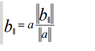
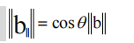
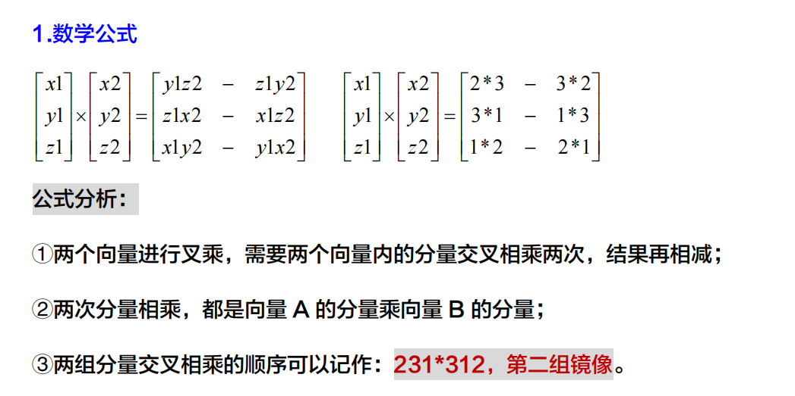
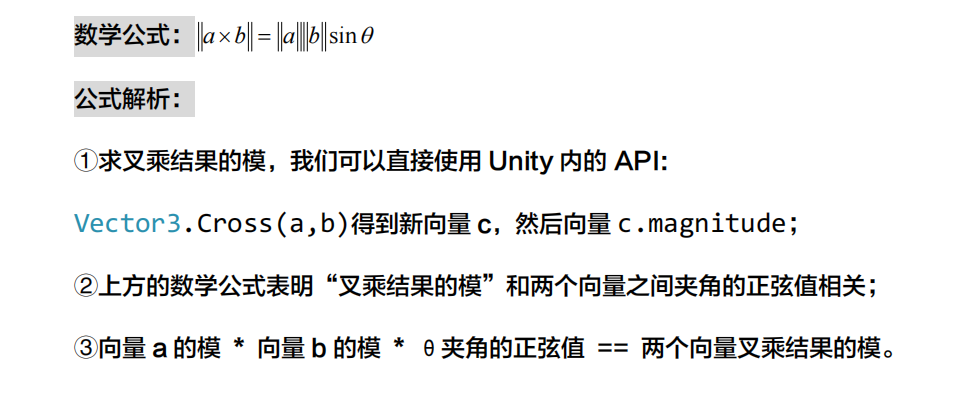
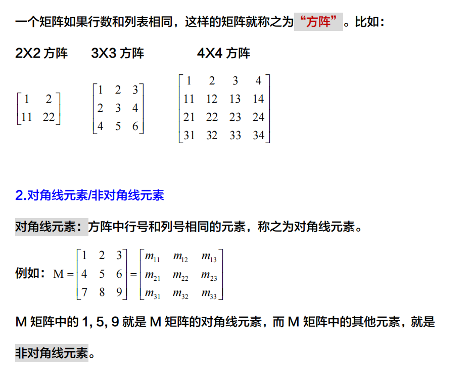
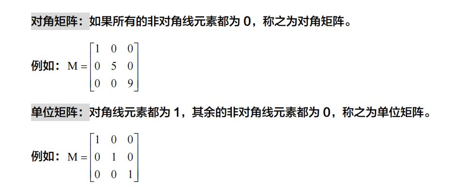

[toc]

# 向量

## 1.基础知识

### 1.零向量

向量当中每一个元素都是零，那么这个向量就是零向量==>[0, 0] [0, 0, 0]

**零向量的长度为 0，方向无法确定。**

### 2.负向量

**数学层面：**

负向量的概念是类似的，一个原始的向量[2, 3, 5]想得到它的负向量，只需要将每个元素取负就行：-[2, 3, 5] == [-2, -3, -5]。

**几何层面：**

一个向量变负向量，就是长度不变，方向相反的一个向量。

### 3.向量大小/长度/模

向量是一个数字的列表；向量是一个有大小和方向的有向线段。向量的大小是需要通过计算的，向量的大小也称之为向量的长度/向量的模。

#### Unity相关Api或者属性

**Vector3.magnitude 只读属性，可以得到向量的大小。**

### 4.标准化向量

标准化向量，也称之为单位向量，也称之为法线。

该向量用于指定方向，而大小不记录。

#### Unity相关Api或者属性

在 Unity 引擎中，Vector3 类型的对象，有一个 normalized 的属性，可以直接获取当前向量的标准化向量。

> Normalized（归一化）
>
> - **含义**：`normalized` 通常指的是一个向量的归一化操作，即将一个向量转换为单位向量（长度为1的向量）。归一化向量保持了原向量的方向，但长度被缩放为1。
> - **用途**：归一化向量在许多计算中非常有用，比如在计算光照、反射、折射时，通常需要使用归一化的向量来确保计算的正确性。在Unity中，你可以使用 `Vector3.Normalize()` 方法来归一化一个向量。
>
> Normal（法线）
>
> - **含义**：`normal` 通常指的是法线向量，它是一个垂直于表面的单位向量。在三维图形中，法线向量用于定义表面的方向，对于光照计算、碰撞检测、纹理映射等非常重要。
>
> - **用途**：法线向量在渲染管线中用于计算光照效果，如漫反射和镜面反射。在Unity中，法线向量通常用于着色器（Shaders）中，以确定如何对表面进行光照处理。
>
>   ### 区别总结
>
>   - **归一化**：指的是将向量缩放到单位长度的过程，与方向无关，只与长度有关。
>   - **法线**：指的是垂直于表面的单位向量，与表面的方向有关，用于定义表面的朝向。
>
>   **[备注：[0, 0, 0]向量是没有标准化向量一说的，因为零向量本来就没有方向]**


### 5.标量与向量相乘 

②标量与向量相乘的运算法则如下：

标量分别与向量的每一个分量（x，y，z）相乘，即可得到一个新向量。这个新的向量与原向量平行，但是长度不同或者方向相反。

### 6.向量的加/减法

[2, 4, 7]和[5, 5, 6]两个向量都是三维向量，它们之间是可以进行加减运算的。

但是[2, 4, 7]和[9, 9]两个向量是不能进行加减运算的，因为它们的维数不同。

**相同维数的向量之间加减法则如下：**

A 向量+B 向量：A 向量的 x，y，z 分别于 B 向量的 x，y，z 相加；

A 向量-B 向量：A 向量的 

### 7.向量距离

向量是一个有向线段，计算两个向量之间的距离，其实就是计算两个点之间的距离。


#### Unity相关Api或者属性

在 Unity 引擎内，我们可以直接通过 **Vector3.Distance(v1, v2)**来得到两个向量之间的距离。

### 8.向量的点乘（内积）

#### 数学意义

**数学公式如下：**

​                                                                                          **$\vec{a} \cdot \vec{b} = |\vec{a}| \times |\vec{b}| \times \cos(\theta)$**


①两个向量进行点乘运算，在书写上是用一个“中间点”将两个向量相连：

②向量[a]的 x,y,z 分量分别与向量[b]的 x,y,z 三个分量相乘，得到三个数值；

③然后将三个数值相加得到一个标量，两个向量点乘最终结果就是一个**标量**。

#### 几何意义

**用于描述两个向量之间的“相似程度“。**点乘这个标量的数值越大，表示两个向量越相近。

- **[a] * [b] > 0** ：两个向量的方向基本相同；
- **[a] * [b] = 0** ：两个向量的方向是正交，也就是互相垂直；
- **[a] * [b] < 0** ：两个向量的方向基本相反；

##### **向量夹角**

两个向量通过点乘运算得到一个标量，我们可以通过这个标量的符号大概的判断出两个向量的关系。如果再进一步计算，我们可以得到两个向量之间夹角的度数。

##### 有关向量夹角的两个公式

###### **公式一**

数学公式： 

​                                                                                                     **$\theta = \arccos\left(\frac{\vec{a} \cdot \vec{b}}{|\vec{a}| |\vec{b}|}\right)$**

**UnityAPI：Vector3.Angle(v1, v2);**

公式解析：

①求向量 a 与向量 b 之间的夹角θ；

②向量 a 与向量 b 先点乘，然后向量 a 与向量 b 分别取模，然后相乘；

③用点乘的结果与取模相乘后的结果相除，最终数据再进行 arccos 运算；

###### **扩展：Unity  arccos：反余弦的Api**

```csharp
[float]Mathf.Acos(float)[得到一个 float 类型的弧度]；
```

###### 扩展：弧度转化成角度公式：

**弧度 * 180 / Mathf.PI**

###### **公式二**

点乘和向量之间的夹角是有相关性的，可以通过公式反向验证。

数学公式：  **$\vec{a} \cdot \vec{b} = |\vec{a}| \times |\vec{b}| \times \cos(\theta)$**

公式解析：

①向量 a 的模 * 向量 b 的模 * θ角的余弦值 == 向量 a 与向量 b 的点乘；

②cos：余弦，Mathf.Cos(float)[返回θ弧度的余弦值]；

###### 扩展：Unity  cos：余弦的Api

Mathf.Cos(float)[返回θ弧度的余弦值]；

#### Unity相关Api或者属性

Vector3 结构体中有一个 Dot 方法，可以接收两个 Vector3 类型的向量，直接得到两个向量的点乘数值：**Vector3.Dot(v1, v3)**。

```csharp
[float]Vector3.Angle(v1, v2); //求两向量夹角
```

#### 应用场景

##### 环境模型隐藏与显示

**1.需求介绍**

①在一个平面场景内，随机散落着一堆 Cube 模型；

②场景内有一个摄像机，可以沿 Y 轴向任意的旋转观看场景内的模型；

③在摄像机旋转的过程中，摄像机视野范围内的模型显示，不在视野内的模型隐藏；摄像机的角度不断改变，场景内的模型的状态需要同步发生改变。

**解决思路**

摄像机的正前方为向量 A，场景内任意环境模型的位置为向量 B；我们可以对这两个向量进行点乘运算：结果大于 0，表示模型与摄像机的正前方基本同方向，反之，则是反方向。（也可以用角度）


### 9.向量投影

1.公式一

公式用途：求向量 b 相对于向量 a 的平行分量，也就是投影。

数学公式：


公式解析：

①首先我们需要得到向量 b 平行分量的模；[未知的，需要单独计算]

②然后得到向量 a 的模；

③两个模相除，然后与向量 a 相乘，就可以得到向量 b 的平行分量。

[代码操作演示]

2.公式二

公式用途：求向量 b 平行分量的模。

数学公式： 


公式解析：

①向量 b 平行分量的模，跟两个向量之间的θ角度是有相关性的，我们可以间

接计算得到；

②得到θ角的余弦值，然后与向量 b 的模相乘；

③将得到的结果带入公式一即可。


#### Unity相关Api或者属性

```csharp
[float]Vector3.Project(v1, v2)
```

API 方法介绍：

Vector3 结构体内有一个 Project（）方法，就是用来计算向量投影的；

v1 和 v2 分别传递进来两个 Vector3 向量，可以得到 v1 在 v2 上的投影。

### 10.向量叉乘（叉积）

#### 数学意义



#### 几何意义

1. 向量 A 和向量 B 进行叉乘运算，得到一个新的向量（向量 C）；

2. 向量 C 分别垂直于向量 A 和向量 B。

3. 向量A X 向量B和 向量B X 向量 A的方向是不一样的。

   > 这个向量的方向满足右手螺旋法则：
   >
   > a×b的方向：四指由a开始，指向b，拇指的指向就是a×b的方向，垂直于a和b所在的平面；
   >
   > b×a的方向：四指由b开始，指向a，拇指的指向就是b×a的方向，垂直于b和a所在的平面；
   >
   > a×b的方向与b×a的方向是相反的，所以：a×b=-b×a，负号代表的是方向相反。

   
   


#### 求叉乘结果的模



#### 扩展：角度和弧度的相互转换

**Unity 本身的 API 也可以按这个数学公式实现逻辑：**

①**Vector3.Angle()方法获取到的是角度值，运行公式需要的是弧度值，所以 Angle()方法的返回值需要 * Mathf.Deg2Rad;**

②角度弧度互相转换：[Deg:角度 Rad:弧度 2:取单词谐音 To,转换的意思]

**弧度 = 角度 * Mathf.Deg2Rad;**

**角度 = 弧度 * Mathf.Rad2Deg;**

③Vector3.Cross()之后直接去模。

#### Unity相关Api或者属性

Vector3 结构体中有一个 Cross 方法，可以接收两个 Vector3 类型的向量，直接得到两个向量叉乘之后的新向量：Vector3.Cross(v1, v2)。

```csharp
[Vector3]Vector3.Cross(v1, v2)
```

# 矩阵

## 矩阵的基础介绍

### 用途

矩阵主要用于描述两个坐标系之间的关系，通过定义一系列的运算，将一个坐标系中的向量转换到另一个坐标系中。

> 例如：Unity 三维游戏场景内的环境模型，角色模型，这些模型是在三维空间内进行控制的，但最终渲染显示在一个二维的屏幕上，中间其实有大量的坐标系信息转换：三维世界坐标系==>二维屏幕坐标系。

### 方阵



### 对角矩阵/单位矩阵



### Unity 矩阵 API

在Unity引擎中和矩阵相关的类(结构体)只有一个Matrix4x4，也就是4X4矩阵。

```csahrp
Matrix4x4 m4x4 = new Matrix4x4
```

构造方法的形参：Vector4 column0~3，表示每个 Vector4 都是一组**列**数据。

#### **矩阵索引**

①取行向量：m4x4.GetRow(行号索引);

②取列向量：m4x4.GetColumn(列号索引);

③取单个分量：m4x4.m 行号列号。
