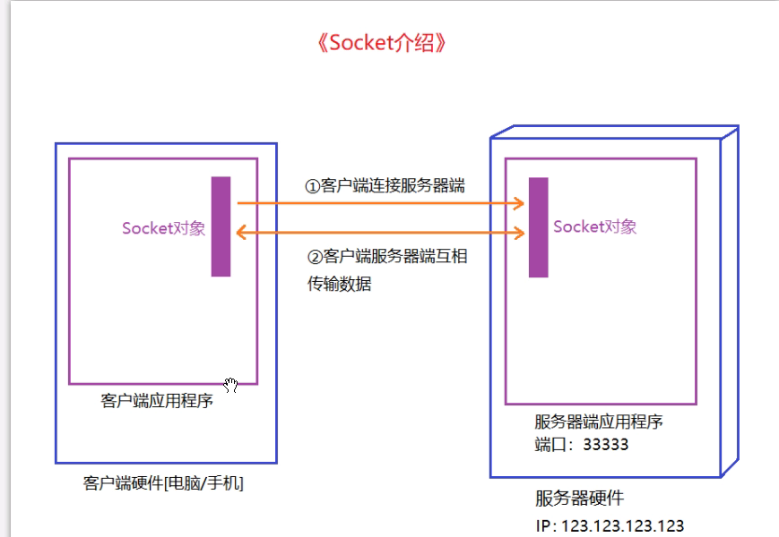

# 理论知识部分

## 1.c#基本数据类型补充

### 整数类型

整数是在数学以及编程开发中，最常用到的数。比如：-15, -1, 0, 18, 72。

整数由负整数，0，正整数三部分组成，整数不包含小数和分数。

之前接触过的整数类型是 int，它的取值返回是“正负 21 亿 4 千 7 百万左右”。

在 C#语言中，**整数类型一共有 8 种**。

**下面就是具体的8种类型：**

#### sbyte 与 byte

类型介绍：

byte：字节型，占 1 个字节的空间。

取值范围：

sbyte：-128~127 [有符号字节型]；

byte：0~255。

#### short 与 ushort

类型介绍：	

short：短整型，占 2 个字节的空间。

取值范围：

short：-32,768 ~ 32,767[有符号短整型]；

ushort：0 ~ 65,535。

#### int 与 uint

类型介绍：

int：整型，占 4 个字节的空间。

取值范围：

int: -2,147,483,648 到 2,147,483,647[有符号整型]；

uint：0 ~ 4,294,967,295

#### long 与 ulong

类型介绍：

long：长整型，占 8 个字节的空间。

取值范围：

long： -10 的 19 次方到 10 的 19 次方[有符号长整型]；

ulong： 0 ~ 大约 10 的 20 次方。


### decimal 类型

基础介绍

decimal 类型和 float 类型，double 类型类似，都是可以存储小数数据的。

由于 decimal 类型占 16 个字节的空间，所以 decimal 类型有更高的精度和更小的范围。该类型经常用于银行，财务相关数据的处理，所以 decimal 类型也可以称之为“金钱/货币类型”。

注意事项

decimal 类型的数据必须以 m 结尾，否则该数据将被当成 double 类型数据

```csahrp
decimal numE = 10.2254564989m;
```

# Socket常用Api以及服务搭建

Socket 用于实现客户端和服务器端数据通信。



## 1.服务器端

**引入如下两个命名空间：**

```csharp
using System.Net;

using System.Net.Sockets;
```

### 创建 Socket 对象

```csharp
Socket socket = new Socket(地址类型，Socket 类型，协议类型);
```

**参数介绍：**

**创建 Socket 对象，我们需要指定三个枚举类型的参数：**

地址类型：使用 IPv4 地址协议，AddressFamily.InterNetwork

Socket 类型：使用流式类型，SocketType.Stream

协议类型：使用 TCP 协议类型，ProtocolType.Tcp

### 创建 IP 对象

```csharp
IPAddress address = IPAddress.Parse(ip 地址字符串);
```

使用 IPAddress 类中的 Parse（）静态方法，可以将我们定义的字符串 IP 转换成 IP 对象。

### 创建端口对象

```csharp
IPEndPoint point = new IPEndPoint(ip 对象, 端口号);
```

使用上一步创建出来的 IP 对象，以及端口号两个数据，我们可以创建出端口号对象。

### 监听绑定

```csharp
socket.Bind(端口对象);
```

使用 Socket 对象中的 Bind（）方法，将 Socket 与端口和 IP 绑定到一块，这样 Socket 对象就可以监听指定端口传输过来的数据。

### 设置最大连接数

```csharp
socket.Listen(数字);
```

使用 Socket 对象中的 Listen（）方法，指定一个最大连接数。也就是说，在某一刻，Socket 服务器端允许最多多少客户端的连接。

### 监听客户端连接

```csharp
Socket clientSocket = socket.Accept();
```

使用 Socket 对象中的 Accept（）方法，监听客户端的连接，如果有客户端连接成功会返回一个与该客户端通讯的 Socket 对象。

### 输出客户端连接信息

```csharp
Debug.Log(clientSocket.RemoteEndPoint.ToString());
```

clientSocket.RemoteEndPoint：获取客户端的 ip 地址和端口。

