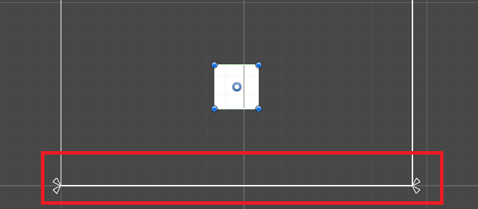
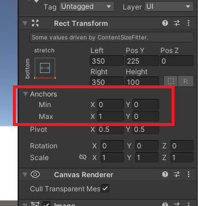

[toc]

# UI组件部分

## 1.Text组件

### 1.面板属性

**Text：文本**

控制当前的 UI 游戏物体要显示的文本内容。

**Font：字体**

控制文字显示的样子；Unity 支持的字体格式是 TTF 格式。

在企业项目开发中，一款游戏，一般会使用到三到五款字体文件。

**Font Style：字体样式**

正常字体，加粗，倾斜，加粗并且倾斜。

这样的字体样式在 Word，Excel，Web 开发都是有的，最基础的字体美化。

**Font Size：字体大小**

控制字体的显示大小，但是当字体很大的时候，需要配合调整当前区域的宽和高，否则字体将因为空间太小，无法显示。

**Line Spacing：行间距**

当 Text 内的文本是多行数据的时候，控制行与行之间的间隔空隙。

**Rich Text：富文本支持**

勾选开启后，我们可以在 Text 内编写富文本标签。比如：<color=“red”>MkCode</color>

**Alignment：对其方式**

控制文本在区域内的九宫显示位置。

**Color：颜色**

控制文本显示的颜色。

**Raycast Target：射线投射目标**

当前游戏物体是否接受射线，如果取消勾选，射线将会直接穿透该物体，勾选则会阻挡射线。

**备注：UGUI 的 UI 交互，是系统以鼠标点击位置发射射线与 UI 进行交互的。**


## 2.Image

### 1.Image 使用

Image 组件是用于显示图片资源的。

使用方式有两种：1.显示纯粹的颜色；2.指定图片源，用于显示图片。

**注意事项：导入 Unity 内的图片资源，如果是用于 UI 显示的，需要手动将这些图片的类型修改为“Sprite(2D and UI)”。**

### 2.组件面板核心属性

**Source Image：设置用于显示的图片。**

**Color：设置用于显示的颜色。**

两个“数据源”可以分开使用，也可以同时使用，如果同时时候，颜色会改变图片的显示色调。如果使用图片，那么颜色就要设置成白色，否则会影响图片效果。

**Set Native Size：设置图片以原始尺寸显示。**

设置完图片，首先就需要点击一下该按钮，保证图片是原始尺寸比例。

### 3.Image 四种显示方式

**1.Image Type：图片显示类型**


Simple：简单模式 --> 60%

Sliced：九宫模式 --> 20%

Tiled：平铺模式 --> 几乎不会用到

Filled：填充模式 --> 20%


**2.Simple 简单模式**

Preserve Aspect：勾选后图片会等比例进行缩放，不会变形。


**3.Sliced 九宫模式**

注意：默认的图片是不支持该模式的，需要编辑图片，设置图片的九宫边框。

> 设置边框的步骤：
>
> ①选中图片->属性区域点击“Sprite Editor”;
>
> ②在编辑面板，设置图片的 Border 边框数值；
>
> ③设置完毕后，不要忘记点击 Apply 保存操作。
>
> 操作：
>
> 设置完毕边框后，对图片进行横向或者纵向拉伸，这个时候图片就会以图片的中心区域进行拉伸，不会拉伸图片的边框效果。


**4.Tiled 平铺模式**

操作：设置成了该模式后，改变图片区域的大小，图片就会以瓷砖平铺的方式进行显示。

如果使用的图片设置了九宫边框，则只会平铺中间区域，不会平铺边框。


**5.Filled 填充模式**

Fill Method：填充方式；水平，垂直，或者角度量；

Fill Origin：填充起点；跟随填充方式发生改变；

Fill Amount：填充量；0~1 表示从无到填充满。


## 3.Button

### 1.Button 面板属性

#### 基本属性

**Interactable**：是否可用，表示当前的按钮是否可以交互。

**Transition**：过渡，Color Tint 和 Sprite Swap。

项目开发过程中，最常用的就是图片过渡方式，按钮交互过程中，切换不同的图片进行状态的展示。


#### 颜色过渡

Normal Color：默认颜色

Highlighted Color：高亮颜色

Pressed Color：按下颜色

Disabled Color：不可用颜色


#### 图片过渡

**Target Graphic**：默认图片，按钮要控制改变的组件。

**Highlighted Sprite**：高亮图片，鼠标进入就会触发；点击按钮后，如果不点击其他位置，则一直触发。项目开发过程中，该图片可以为空。

**Pressed Sprite**：按下图片，鼠标按下切换成该状态。

**Disabled Sprite**：不可用图片，按钮禁用后显示的图片。

## 4.Toggle复选框

### 1.s属性

**is On**：表示当前 Toggle 的状态，是选中还是未选中。另外该属性只是响应UI 的状态切换，在面板上操作该属性不会影响 UI 状态。

**Target Graphic**：对应的是 Toggle 的背景图；

**Graphic**：对应的是 Toggle 的选中图。

## 5.Slider 滑块

### 5.1.Slider 组成部分分析

Slider 组件 [核心控制组件]

- Image 组件 [Slider 的背景图片]
- 空物体 [用于控制填充图片的活动范围]
  - Image 组件 [填充图片]
- 空物体 [用于控制滑块图片的活动范围]
  - Image 组件 [滑块图片]

### 5.2.Slider 组件属性

#### 特有属性

**Fill Rect**：滑块条游戏物体的 Transform；

**Handle Rect**：滑块游戏物体的 Transform；

**Direction**：滑块的滑动方向；

**Min Value**：滑块组件最小值；

**Max Value**：滑块组件最大值；

**Whole Numbers**：整数，勾选后 Slider 只能整数控制；

**Value**：当前滑块组件的值。


## 6.Scrollbar 卷动条

Scrollbar 组件在游戏 UI 开发中，并不常用。

但是在一些其他的软件开发中，却大量使用；浏览器，各种文本编辑器。[见图]

当我们想在一个固定的区域范围内显示很多数据时，可以用到 Scrollbar，来实现类似于卷轴的效果。

### 6.1.Scrollbar 组成部分分析

Scrollbar Image [整体功能控制 + 背景图片显示]

- 空物体 [控制子物体活动范围]
  - Image [滑块图片]

### 6.2.特有属性分析

**Size**：用于控制滑块的大小；

**Number Of Steps**：用于控制滑块每次移动的步长。


## 7.InputField 输入栏

### 7.1.InputField 组成部分分析

InputField Image [整体控制组件，背景图片]

- Text [提示文本]
- Text [接收用户输入的文本]

### 7.2.特有属性

**Text Component**：用于接收显示用户输入内容的 Text 组件；

**Text**：在该区域输入的文本会直接显示在 Text 组件上；

**Character Limit**：字符限制，表示该输入框能输入的最大长度，0 表示不限制；

**Content Type**：内容类型，用于限制输入的数据类型；

**Line Type**：行类型，用于设置输入栏是单行还是多行；

- Single Line：单行模式，也是默认模式；
- Multi Line Submit：多行，不支持回车键换行；
- Multi Line NewLine：多行，支持回车键换行。


## 8.ScrollRect 卷动区域

ScrollRect：卷动区域。

“卷动区域”是在 ScrollBar 的基础之上延伸出来的 UI 界面效果。

单独是 ScrollBar 组件是无意义的，需要结合 ScrollRect 才能真正实现功能。

### 8.1.ScrollRect 组成部分分析

ScrollRect Image [核心组件，背景图片]

- Mask Image [遮罩，用于遮罩的图片]
  - 空物体 [用于卷动显示的数据]

- 横向卷动条 [ScrollBar 游戏物体]

- 纵向卷动条 [ScrollBar 游戏物体]

### 8.2.ScrollRect 组件属性

#### 1.基本控制属性

Content：ScrollRect 控制的数据区域；

Horizontal：控制数据是否可以横向拖动；

Vertical：控制数据是否可以纵向拖动；

Movement Type：三种运动类型；[不限制 -- 弹性 -- 不动]

#### 2.引用控制属性

Viewport：视口区域的引用；

Scrollbar：Scrollbar 游戏物体的引用；

Visibilty：卷动条的清晰度，保持默认即可[第三个]；

Spacing：控制卷动条和数据区域之间的间距。

## 9.Canvas 组件

### 9.1.三种渲染模式

#### 1.Overlay 模式

##### 模式介绍

该模式全称是 Screen Space-Overlay（屏幕空间-覆盖模式）。

- 屏幕空间：指的是电脑或者手机显示屏的 2D 空间，x 轴和 y 轴；

- 覆盖模式：指的是 UI 元素永远在 3D 元素的前面，UI 覆盖 3D；

Canvas 创建出来后，默认就是该模式

**备注：该模式和摄像机无关，即使场景内没有摄像机，UI 游戏物体照样渲染。在 Overlay 模式下，UGUI 和摄像机无关。**

##### 相关属性

**Pixel Perfect**：完美像素，UI 和屏幕像素对应，UI 图片不会出现锯齿边缘；

**Sort Order**：排序层，用于设置画布的深度层级（场景存在多个 Canvas 时）；

在同一个场景内是允许出现多个 UGUI 的 Canvas 画布[演示]。

#### 2.Camera 模式

##### 模式介绍

该模式全称是 **Screen Space-Camera（**屏幕空间-摄像机模式）。

摄像机模式：设置成该模式后，需要指定一个摄像机游戏物体，指定完毕后，

UGUI 就会自动出现在该摄像机的“投射范围”内。

如果现在隐藏掉摄像机游戏物体，UGUI 也是无法渲染显示的。

##### 相关属性

Render Camera：渲染摄像机，指定用于渲染 UGUI 元素的摄像机；

Plane Distance：面板距离，控制 UGUI 元素和摄像机之间的距离。

#### 3.WorldSpace 模式

#### 1.模式介绍

该模式全称就是 WorldSpace（世界空间模式）。

世界空间模式：是相对于屏幕空间而言的，世界空间是 x，y，z 三个轴向。

设置成该模式后，UGUI 就相当于是场景内的一个普通的“Cube 游戏模型”，我们是可以在场景内任意的移动 UGUI 元素的位置。


## 10.CanvasScaler 画布定位器

在 UGUI 中用于实现“屏幕自适应”需要用到两个组件：

①AnChors [锚点] 

②Canvas Scaler [画布定位器]

我们先说说这个画布定位器。

**Canvas Scaler 组件有三种定位模式：**

①Constant Pixel Size

②Scale With Screen Size

③Constant Physical Size

### Constant Pixel Size 模式

#### 1.模式介绍

该模式可以称之为“**恒定**(固定)像素大小模式”，UGUI 默认就是该模式。

该模式下的 Scale Factor 参数会作用于 Canvas 游戏物体的 Scale 参数。

在该模式下无论屏幕尺寸发生什么样的变化，UI 元素的大小都不会改变。

#### 2.相关属性

Scale Factor：比例因子，默认保持为 1 即可；

Reference Pixels Per Unit：参考像素单位，默认保持为 100 即可。

### Scale With Screen Size 模式

#### 模式介绍

该模式可以称之为“**跟随屏幕尺寸缩放模式**”，在手游项目开发中，使用该模式。

该模式下 UI 元素的尺寸就不是固定的了，会跟随屏幕的尺寸比例进行相应的自动缩放。

#### 相关属性

**Reference Resolution**：参考分辨率，设置成项目开发时使用的分辨率。

**Screen Match Mode**：屏幕匹配模式，推荐用第一种模式。

- Match Width Or Height [匹配宽度或者高度]

- Expand [扩大] 

- Shrink [缩小]

Match：匹配，当屏幕匹配模式选择为 Match Width Or Height 时该属性有效。

一个滑块控制条，0~1，代表宽和高。

**横屏游戏用 Height 匹配，竖屏游戏用 Width 匹配[以短方向进行匹配]。**

### Contant Physical Size 模式

该模式可以称之为“恒定(固定)的物理尺寸”，在该模式下 UI 元素永远保持固定的物理尺寸，

## 11.表格布局组件 Grid Layout Group 组件

Grid Layout Group：表格(网格)布局组件，可以让数据按表格的形式排列。

Cell Size：子物体尺寸；

Spacing：子物体之间的间距；

Start Corner：子物体开始的角度位置；

Start Axis：子物体开始的轴向；

Child Alignment：子物体对其方式；

Constraint：约束方式，灵活--灵活列数--灵活行数；

Padding：控制所有子物体的整体的外边距。

### 示例：

#### 1.签到页面案例

数据量有限，在一个界面内能直接显示完毕，不需要滑屏滚动。

层级结构：

Image [背景图片]

- Grid Layout Group [表格布局组件]
  - Item [N 个同级别的子物体]

#### 2.背包页面案例

数据量很大，在一个界面内无法直接显示完毕，需要使用上下滑屏来显示数据。

层级结构：

Image + ScrollRect + Mask [背景图片，滑动组件，区域遮罩]

- Grid Layout Group [表格布局组件]
  - Item [N 个同级别的子物体]

**关键操作：**

**①ScrollRect 需要持有 Grid Layout Group 组件所在的游戏物体；**

**②ScrollRect 根据需要勾选是否支持横向或者纵向滑动。**


## 12.横向和纵向布局组件

### 1.横向布局组件

#### 组件介绍

Horizontal Layout Group：横向布局组件。

表格布局组件是功能最全的一个布局组件，可以实现表格，横向，纵向布局；

而横向布局组件可以理解成是表格布局组件功能的一部分。

#### 组件属性

Child Controls Size：子物体的大小。

|---勾选 Width：自动缩放所有子物体的宽度，让子物体横向占满空间.

|---勾选 Height：自动缩放所有子物体的高度，让子物体竖向占满空间. 

Child Force Expand：子物体的扩展。

如果要使用上方的“子物体的大小”属性，这里的属性必须勾选。

上方的属性依赖该属性。


### 2.纵向布局组件

#### 组件介绍

Vertical Layout Group：纵向布局组件。

纵向布局组件和横向布局组件使用是完全一样的，包括组件属性也是完全一样；

区别就是一个是横向，一个是纵向

# UI事件接口

## 1.Drag 拖拽事件接口

### 三个拖拽事件相关接口

**IBeginDragHandler**：开始拖拽事件处理器；开始拖拽的一瞬间触发。

**IDragHandler**：拖拽中事件处理器；拖拽过程中持续触发。

**IEndDragHandler**：结束拖拽事件处理器；拖拽结束的一瞬间触发。

### 通过拖拽事件改变图片位置

```csharp
[Vector3]RectTransformUtility.ScreenPointToWorldPointInRectangle(m_RectTransform,eventData.position,eventData.enterEventCamera,out pos); //屏幕坐标点转化为世界坐标点；
```

>**其中：**
>
>`m_RectTransform`   //游戏物体的 RectTransform ;
>
>`eventData.position`  //当前坐标位置点；
>
>`eventData.enterEventCamera`  //事件摄像机；
>
>`out pos`  //最终计算得到的世界坐标位置；

**PointerEventData：指针事件数据。(实现接口传的参数)**

上面的这个方法我们只需要写在“拖拽中事件”方法内，将最终的 pos 位置值持续赋值给当前游戏物体的 position 即可，就可以实现拖拽改变图片的位置。

### 示例:见UGUI练习项目 ItemDrag.cs

## 2.Pointer 指针

### 五个指针相关事件接口

IPointerEnterHandler：指针进入事件处理器；一瞬间触发。

IPointerExitHandler：指针离开事件处理器；一瞬间触发。

IPointerDownHandler：指针按下事件处理器；一瞬间触发。

IPointerUpHandler：指针抬起事件处理器；一瞬间触发。

IPointerClickHandler：指针单击事件处理器；指针按下+抬起=单击。

# UI的定位布局

**先说下我的理解以及注意事项：**

1. 无论是九宫定位还是弹性定位，都是为了更方便来帮我们更精确的布置物体的位置的，相对于自己拖拽。
2. 九宫定位和弹性定位，只是锁定了中心点到锚点的距离，ui本身还是会随着屏幕比例变化而发生形态上的改变的。
3. [0,1]的比例坐标系，原点是左下角。
4. 子物体的位置总是相对于父物体锚点的。


## 1.九宫格定位

如图所示的左面的行列，以及中间的九宫格。中间的九宫格可以理解成是左面的行列拼凑而成的。

他的用途就是设置描点的位置(不分割的情况下)，常规操作是 **设置锚点的位置>设置UI中心点的位置>偏移量变成0** 来布局。

## 2.弹性定位

右面的行列代表的是弹性定位，弹性定位代表的是将锚点沿着箭头方向拆开，使得物体中心能具有相对于锚点分开的各个方向的固定偏移量，使得UI物体的位置更精准。



## 3.Anchors属性辅助定位

Anchors属性是一种帮助上面两种定位的辅助手段，它的出现使得锚点不止可以在UI面板的边界，还可以在UI面板的各个地方，极大的增加了灵活性。



他有两组数值，分别代表了锚点在x轴和y轴的最大值和最小值，规划了锚点在x轴和y轴的范围。


# JSON数据格式的使用

## 1.JSON 数据之语法格式

### 1.JSON 介绍和使用

#### 1.什么是 json？

**Json：JavaScript Object Notation [JS 对象表示法]**

1. Json 和 XML 是比较类似的技术，都是可以用来存储文本信息数据的；但是相对而言，Json 比 XML 的体积更小巧，但是易读性不如 XML。
2. Json 是轻量级的文本数据交换格式，可以用于服务器和客户端之间的数据传输的载体；XML 也是可以完成这个任务的。
3. Json 和 XML 一样，并不是哪一门语言的专属技术，而是通用的，几乎所有的编程语言都可以操作和使用 Json，XML 相关的数据文件。
4. Json 作为一种语法格式，最早出现在 Web 开发领域，由于 Json 优点众多，于是才被大部分语言所支持，其实软件开发领域很多技术都是这样来的。


#### 2.JSON 语法格式

语法格式：

```json
[

	{
		"Name":"Monkey",
	
		"Age":100,
	
		"Address":"BeiJing"

	},

	{

		"Name":"MKCODE",

		"Age":2,

		"Address":"ShanDong"

	}

]
```

**语法注意事项：**

①当有多个数据对象时,最外层用[]包裹，表示是一个数组；

②每一对{}都表示一个独立的数据对象；

③Json 对象内的数据，是以键值对的形式存在的；

④Json 中字符串需要用“”包裹；

⑤Json 中需要用逗号进行数据分割，且“最后的位置”不需要写逗号。


### 2.Unity 使用 JSON

#### 1.Unity 内导入第三方 DLL

在 Unity 项目开发过程中经常会用到一些第三方的 DLL 文件。比如我们现在想 Unity 项目内操作 JSON，就需要导入一个叫做`LitJson.dll`的库文件。

操作步骤如下：

①Unity 项目内创建一个 **Plugins** 文件夹；

②dll 文件拖拽到该文件夹下；

③在需要使用该 dll 的脚本文件内，使用 using 命令引入 dll 对应的命名空间。

#### 2.LitJson.dll封装的方法

##### 对象转换为 Json 字符串

```csharp
JsonMapper.ToJson(object) //可以将任何的对象转换为 Json 数据字符串。
```

##### Json 字符串转换为对象

```csharp
JsonMapper.ToObject<T>(jsonStr)  //可以将 Json 格式的字符串转换为指定的泛型对象。
```

> 注意：LitJson 不支持 float 类型，我们用同样是小数的 double 类型存储。但有些数据是float类型，此时确实可以用double存储，但是double位数太高了，我们可以把他转换成string存储。