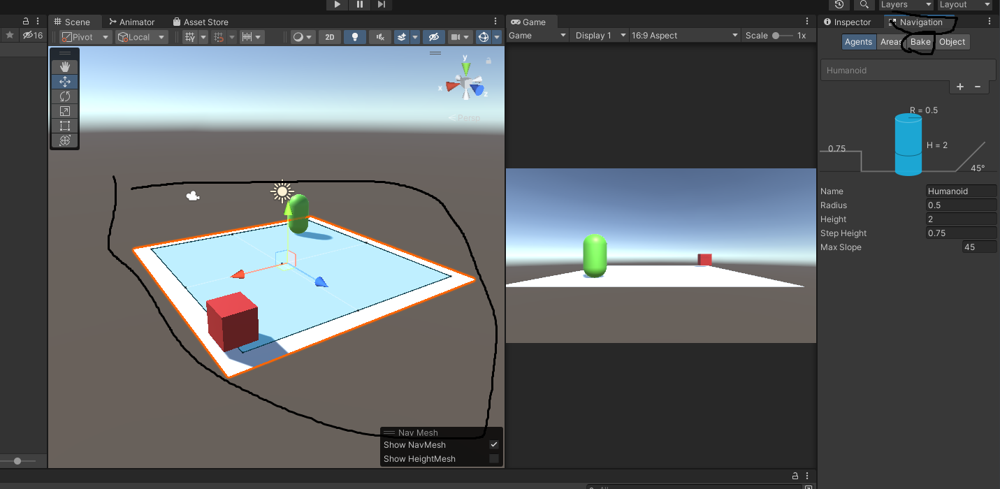
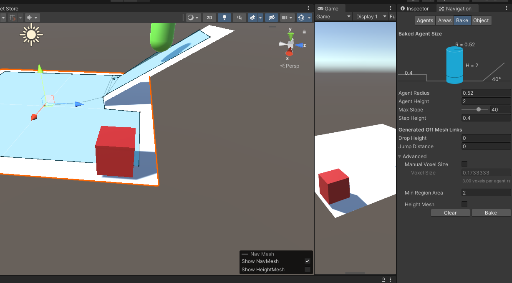
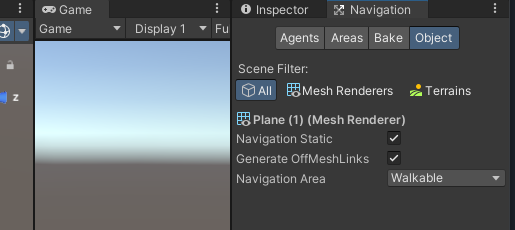
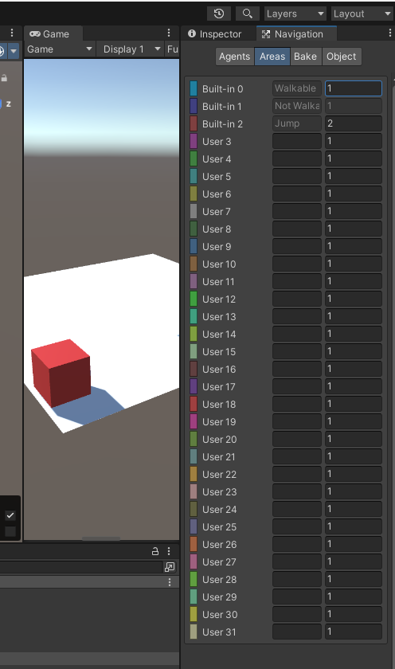
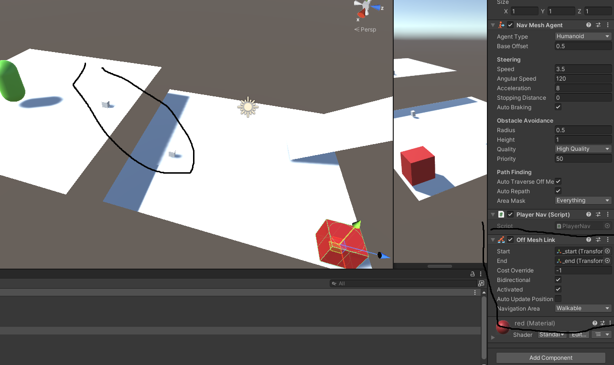
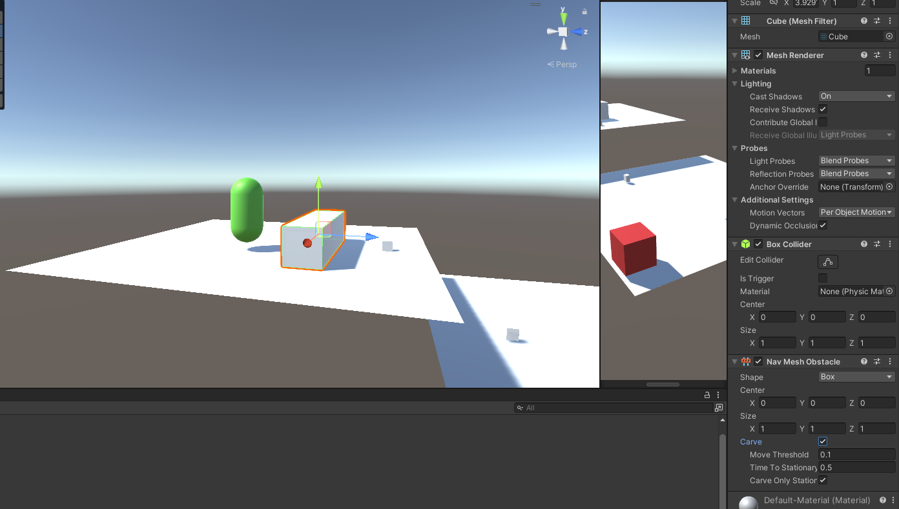
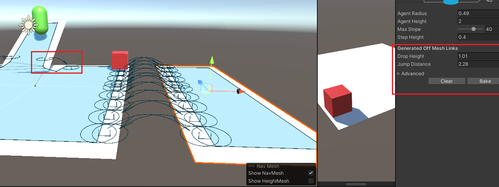
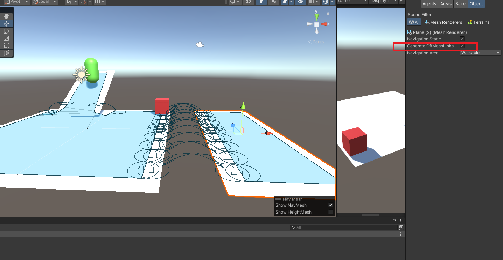
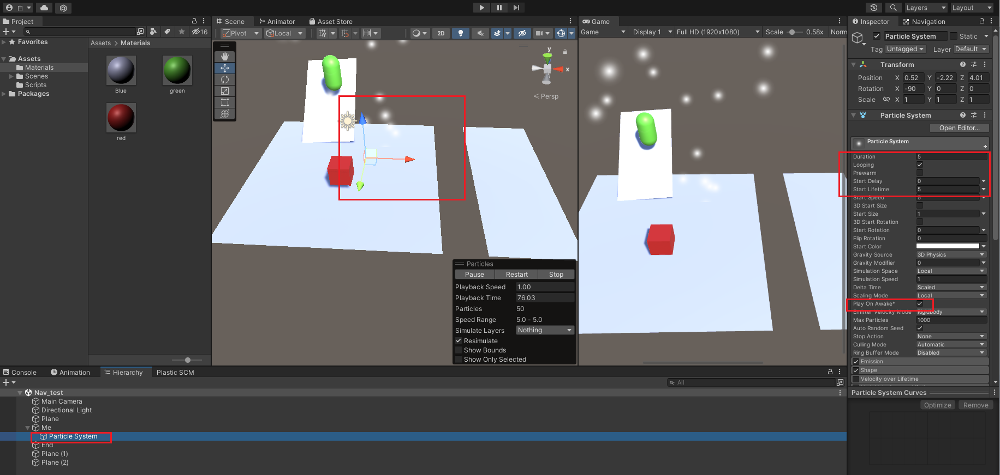
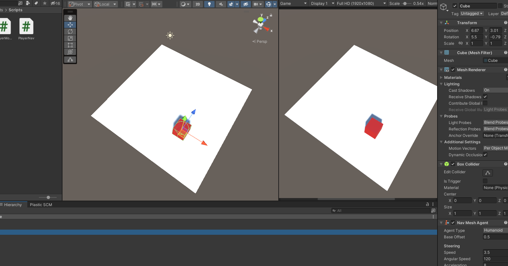

# 导航系统介绍篇

## 一些注意事项和问题

### 1.导航线的起点或者终点没有圆环了怎么办？


起点和终点距离烘焙区域太远了，拉回来。

## 1.导航系统的搭建和使用

**烘焙场景**

1. 将想要烘焙的场景勾选 static，变成静态物体；
2. Window-->Navigation-->Bake-->Bake，烘焙导航场景。也就是说“标示出角色可以移动行走的范围”，烘焙完毕后，会出现一个和场景同名的文件夹，保存导航网格烘焙的数据。



**要导航的角色进行脚本和组件绑定**

1. 角色身上添加组件 NavMeshAgent（导航网格代理器），由该组件负责实现导航功能。

2. 控制该组件，设置导航目的地。

   **脚本：**

   ```csharp
   using System.Collections;
   using System.Collections.Generic;
   using UnityEngine;
   using UnityEngine.AI;
   
   public class PlayerNav : MonoBehaviour
   {
       //获取
       private NavMeshAgent m_NavMeshAgent;
       private Transform end_Transform;
   
       void Start()
       {
           m_NavMeshAgent = gameObject.GetComponent<NavMeshAgent>();
           end_Transform = GameObject.Find("End").GetComponent<Transform>();
           //设置导航
           m_NavMeshAgent.SetDestination(end_Transform.position);
       }
   }
   
   ```


## 2.NavMeshAgent 组件参数

- **Agent Size[**代理器大小]
  1. **Radius**[半径]：控制代理器这个“圆柱体”的半径；
  2. **Height**[高度]：控制代理器这个“圆柱体”的高度；
  3. **Base Offset**[基础偏移]：控制代理器这个“圆柱体”在垂直方向的偏移量；

**注意事项：**

①Agent Size 的大小设置成正好包裹住模型即可。

②“圆柱体”的优先级高于“碰撞器”。


- Steering[操作]
  1. **Speed**[速度]：导航的移动速度；
  2. **Angular** **Speed**[转弯速度]：模型是 Y 轴朝向目标点；如果不是，则转向；
  3. **Acceleration**[加速度]：保持默认即可；
  4. **Stopping** **Distance**[停止距离]：距离目的地多远的时候停止；
  5. **Auto Braking**[自动停止]：保持默认勾选状态即可；

## 3.Navigation 面板参数

**如图：**



- **Baked Agent Size**[烘焙代理器大小]

  **Agent Radius[代理器半径]**：控制不可导航区域面积

  **Max Slope[最大爬坡能力]**：当场景中的导航地面有斜坡的时候，控制低于多少度的斜坡可以导航攀爬。

  **Step Height[台阶高度]**：当场景中出现台阶的时候，控制多高的台阶角色可以导航。（但是这个台阶的高度不能高于 Agent Height 的高度。)

  **备注说明**

  这四个参数都是要配合场景的具体环境来进行设置的。

  而且这四个参数是与 NavMeshAgent 组件相关的。导航里所有障碍物都共享这个设置。

  



**Navigation Static**：当前模型是否参与了“导航系统”；

**Generate OffMeshLinks**：生成“网格跳跃线”；

**Navigation Area**：导航区域，定义当前区域的“地表类型”。




这个就是设置各个地块以及他们的行走难度，有点像程序谁先执行那个。


设置完然后在这里的 **Navigation Area** 里选择就行。

## 4.OffMeshLink 组件基本使用

这是个什么组件呢？应该算是一个设置跳跃起始点，帮助完成导航过程遇到的跳跃场景的组件。



给要被导航的物体装上。

**参数介绍：**

**1.Start 和 End**

用于设置“跳跃线”的**开始**点和**结束**点，两点成线。

**2.Cost Override [代价覆盖]**

定义角色通过这个“跳跃线”所要付出的**代价**是多少。

默认值是-1，代表角色通过该跳跃线不需要代价。

**注意：这里的代价覆盖的是“Navigation Area”参数指定的地形代价。**

**3.Bi Directional [双向跳跃线]**

该属性是一个复选框，如果勾选，则角色可以在两点之间**来回**的跳跃移动；

如果不勾选，则只是单行道，只能从开始点跳跃到结束点。

**4.Activated [激活状态]**

用于设置该跳跃线**是否激活**，是否可用。

激活状态：跳跃线为深蓝色；未激活状态：跳跃线为暗红色。

**5.Auto Update Positions[自动更新位置]**

如果勾选该参数，则表示自动更新位置，我们在运行状态的时候，是可以动态的改变开始点或者结束点的位置的，同时跳跃线也会动态的更新，反之亦然。

> **OffMeshLink 注意事项：**
>
> **1.开始点和结束点可以是模型，也可以是空物体，**只需要具备 Transform 组件即可；
>
> **2.开始点和结束点不需要静态**，因为这个“跳跃线”不需要参与 Navigation面板上的网格烘焙；
>
> **3.开始点和结束点不能距离烘焙出来的导航网格太远；**
>
> 开始点和结束点的位置是有两个圆圈的，如果没有圆圈说明这个位置点距离烘焙出来的导航网格太远，需要手动调进它们之间的距离。


## 5.NavMeshObstacle 组件基本使用



### **Nav Mesh Obstacle：导航网格障碍物的介绍：**

在角色的导航范围内，如果说需要出现障碍物，我们一般是将这些障碍物设置为静态，一起参与 Navigation 的导航烘焙；这样的话，我们的角色在导航的时候，就不会与这些障碍物模型相碰撞。

但是如果说我们需要一些“动态的导航障碍物”，这些障碍物模型不设置静态，不参与烘焙，甚至是通过代码实例化出来的模型动态的添加到我们的导航地形中，我们就需要用到一个新的组件了，这个组件就是 Nav Mesh Obstalce。

### NavMeshObstacle 面板属性

**1.Shape[形状]**

控制障碍物的形状，正方体或者胶囊体。

注意：这个障碍物可以是一个空物体，我们就是通过这个 Shape 属性来控制这个障碍物的范围。

**2.Carve[雕刻]**

只有勾选了该属性，这个障碍物才会生效。

勾选上该属性后，会出现如下三个可以控制的参数：

**Move Threshold：[移动阈值]**

大于该值的移动，才认为是真正发生了移动。

**Time To Stationary：[时间静止]**

每间隔多长时间，检查一次该障碍物的位置，如果发生了移动则动态的更新导航网格的数据。

**Carve Only Stationary：[仅雕刻静止物体]**

勾选后，则按上面的时间间隔，固定的检查位置，固定时长更新网格数据；

如果不勾选，则是每帧都会检查位置，如果发生位移，立刻更新网格数据。

## 6.OffMeshLinks 自动生成



烘培面板上的参数，可以批量生成跳跃线。

### OffMeshLinks 使用

**1.基础说明**

在 Navigation 面板的 Bake 选项中有一个“Generated Off Mesh Links”这么一组设置选项，我们就是通过这个区域的来控制如何 自动生成跳跃线。

**2.Drop Height [落差]**

在多高的落差之间生成跳跃线。落差：指的是垂直方向。

默认值为 0，表示该选项无效；

设置成其他的数字，比如 2，则会在落差 2 以内的区域内自动生成跳跃线。

**注意：这时生成的跳跃线是单向的，高处往低处跳跃。**

**3.Jump Distance [跳跃距离]**

在多远的距离之间生成跳跃线。距离：指的是水平方向。

默认值为 0，表示该选项无效；

设置成其他的数字，比如 2，则会在距离 2 以内的区域内自动生成跳跃线。

**注意：这时生成的跳跃线也是单向的，但是，距离方向的跳跃线往往是成组生成，所以还是可以双向移动的。**


### DLC:如何取消生成自动跳跃线？



这个勾了之后，当前静态场景不自动生成跳跃线。

## 7.ParticleSystem粒子系统

项目操作面板右键 > Effects >ParticleSystem 创建。



### **常用面板属性：**

**1.Duration [持续时间]**

Particle 是粒子的意思，也就是特效的最小组成单位。

这里的持续时间，就是指的“粒子生成器”在多长的时间内，持续生成粒子。

**2.Looping [循环]**

控制特效是否循环播放。

很多时候特效是不需要循环播放的，比如角色的某个技能特效，只有当角色释放该技能的时候播放一次就够了。

**3.Start Delay [启动延迟]** 

一个真正的特效，往往是由几个小的，单独的特效组合而成，特效与特效之间的播放，是有先后顺序的，就可以使用这里的启动延迟来控制。

**4.Start Lifetime [生命周期]**

控制粒子的存活时间。

也就是粒子从“粒子生成器”中生成，到该粒子消失，之间的时长。

**5.Play On Awake [唤醒时自动播放]** 

一般情况这个选项是取消勾选的。

如果勾选了该选项，在我们游戏运行起来的那一刻，就会自动播放；

但是游戏中大部分的特效，其实是不能自动播放的，特效是需要程序员根据具体的技能，具体的操作，来控制播放哪个特效的。

### 脚本控制

```csharp
using System.Collections;
using System.Collections.Generic;
using UnityEngine;

public class ParticleDemo : MonoBehaviour {

    private ParticleSystem m_ParticleSystem;

	void Start () {
        m_ParticleSystem = gameObject.GetComponent<ParticleSystem>();
	}
	
	void Update () {
		if(Input.GetKeyDown(KeyCode.A))
        {
            //播放
            m_ParticleSystem.Play();
        }

        if(Input.GetKeyDown(KeyCode.B))
        {
            //停止
            m_ParticleSystem.Stop();
        }
	}
}

```


# 导航案例篇

## 1.角色随鼠标点击移动



搭个场景，烘焙好。

**挂上脚本：**

```csharp
using System.Collections;
using System.Collections.Generic;
using UnityEngine;
using UnityEngine.AI;

public class PlayerMoveByMouse : MonoBehaviour
{
    private Ray ray;
    private RaycastHit raycastHit;
    private NavMeshAgent navMeshAgent;
    private Transform transform;

    void Start()
    {
        transform = gameObject.GetComponent<Transform>();
        navMeshAgent = gameObject.GetComponent<NavMeshAgent>();
    }

    // Update is called once per frame
    void Update()
    {
        Move();
    }

    private void Move()
    {
        //获取鼠标点击位置
        ray = Camera.main.ScreenPointToRay(Input.mousePosition);
  
        //判断是左键点击之后再导航，否则会一直跟着鼠标
        if (Input.GetMouseButtonDown(0))
        {
            if (Physics.Raycast(ray, out raycastHit))
            {
                //设置目的地
                navMeshAgent.SetDestination(raycastHit.point);
            }
        }
      
    }
}

```

