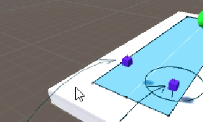

[toc]

# 导航系统介绍篇

## 一些注意事项和问题

### 1.导航线的起点或者终点没有圆环了怎么办？



起点和终点距离烘焙区域太远了，拉回来。

### 2.给地面换了贴图，角色没了阴影怎么办？


修改地面的`Shader`, 将 Shader 修改成 Legacy Shader 下的 Diffuse。

## 1.导航系统的搭建和使用

**烘焙场景**

1. 将想要烘焙的场景勾选 static，变成静态物体；
2. Window-->Navigation-->Bake-->Bake，烘焙导航场景。也就是说“标示出角色可以移动行走的范围”，烘焙完毕后，会出现一个和场景同名的文件夹，保存导航网格烘焙的数据。


**要导航的角色进行脚本和组件绑定**

1. 角色身上添加组件 NavMeshAgent（导航网格代理器），由该组件负责实现导航功能。

2. 控制该组件，设置导航目的地。

   **脚本：**

   ```csharp
   using System.Collections;
   using System.Collections.Generic;
   using UnityEngine;
   using UnityEngine.AI;
   
   public class PlayerNav : MonoBehaviour
   {
       //获取
       private NavMeshAgent m_NavMeshAgent;
       private Transform end_Transform;
   
       void Start()
       {
           m_NavMeshAgent = gameObject.GetComponent<NavMeshAgent>();
           end_Transform = GameObject.Find("End").GetComponent<Transform>();
           //设置导航
           m_NavMeshAgent.SetDestination(end_Transform.position);
       }
   }
   
   ```


## 2.NavMeshAgent 组件参数

- **Agent Size[**代理器大小]
  1. **Radius**[半径]：控制代理器这个“圆柱体”的半径；
  2. **Height**[高度]：控制代理器这个“圆柱体”的高度；
  3. **Base Offset**[基础偏移]：控制代理器这个“圆柱体”在垂直方向的偏移量；

**注意事项：**

①Agent Size 的大小设置成正好包裹住模型即可。

②“圆柱体”的优先级高于“碰撞器”。


- Steering[操作]
  1. **Speed**[速度]：导航的移动速度；
  2. **Angular** **Speed**[转弯速度]：模型是 Y 轴朝向目标点；如果不是，则转向；
  3. **Acceleration**[加速度]：保持默认即可；
  4. **Stopping** **Distance**[停止距离]：距离目的地多远的时候停止；
  5. **Auto Braking**[自动停止]：保持默认勾选状态即可；

## 3.Navigation 面板参数

**如图：**


- **Baked Agent Size**[烘焙代理器大小]

  **Agent Radius[代理器半径]**：控制不可导航区域面积

  **Max Slope[最大爬坡能力]**：当场景中的导航地面有斜坡的时候，控制低于多少度的斜坡可以导航攀爬。

  **Step Height[台阶高度]**：当场景中出现台阶的时候，控制多高的台阶角色可以导航。（但是这个台阶的高度不能高于 Agent Height 的高度。)

  **备注说明**

  这四个参数都是要配合场景的具体环境来进行设置的。

  而且这四个参数是与 NavMeshAgent 组件相关的。导航里所有障碍物都共享这个设置。

  


**Navigation Static**：当前模型是否参与了“导航系统”；

**Generate OffMeshLinks**：生成“网格跳跃线”；

**Navigation Area**：导航区域，定义当前区域的“地表类型”。


这个就是设置各个地块以及他们的行走难度，有点像程序谁先执行那个。


设置完然后在这里的 **Navigation Area** 里选择就行。

## 4.OffMeshLink 组件基本使用

这是个什么组件呢？应该算是一个设置跳跃起始点，帮助完成导航过程遇到的跳跃场景的组件。


给要被导航的物体装上。

**参数介绍：**

**1.Start 和 End**

用于设置“跳跃线”的**开始**点和**结束**点，两点成线。

**2.Cost Override [代价覆盖]**

定义角色通过这个“跳跃线”所要付出的**代价**是多少。

默认值是-1，代表角色通过该跳跃线不需要代价。

**注意：这里的代价覆盖的是“Navigation Area”参数指定的地形代价。**

**3.Bi Directional [双向跳跃线]**

该属性是一个复选框，如果勾选，则角色可以在两点之间**来回**的跳跃移动；

如果不勾选，则只是单行道，只能从开始点跳跃到结束点。

**4.Activated [激活状态]**

用于设置该跳跃线**是否激活**，是否可用。

激活状态：跳跃线为深蓝色；未激活状态：跳跃线为暗红色。

**5.Auto Update Positions[自动更新位置]**

如果勾选该参数，则表示自动更新位置，我们在运行状态的时候，是可以动态的改变开始点或者结束点的位置的，同时跳跃线也会动态的更新，反之亦然。

> **OffMeshLink 注意事项：**
>
> **1.开始点和结束点可以是模型，也可以是空物体，**只需要具备 Transform 组件即可；
>
> **2.开始点和结束点不需要静态**，因为这个“跳跃线”不需要参与 Navigation面板上的网格烘焙；
>
> **3.开始点和结束点不能距离烘焙出来的导航网格太远；**
>
> 开始点和结束点的位置是有两个圆圈的，如果没有圆圈说明这个位置点距离烘焙出来的导航网格太远，需要手动调进它们之间的距离。


## 5.NavMeshObstacle 组件基本使用


### Nav Mesh Obstacle：导航网格障碍物的介绍：

在角色的导航范围内，如果说需要出现障碍物，我们一般是将这些障碍物设置为静态，一起参与 Navigation 的导航烘焙；这样的话，我们的角色在导航的时候，就不会与这些障碍物模型相碰撞。

但是如果说我们需要一些“动态的导航障碍物”，这些障碍物模型不设置静态，不参与烘焙，甚至是通过代码实例化出来的模型动态的添加到我们的导航地形中，我们就需要用到一个新的组件了，这个组件就是 Nav Mesh Obstalce。

### NavMeshObstacle 面板属性

**1.Shape[形状]**

控制障碍物的形状，正方体或者胶囊体。

注意：这个障碍物可以是一个空物体，我们就是通过这个 Shape 属性来控制这个障碍物的范围。

**2.Carve[雕刻]**

只有勾选了该属性，这个障碍物才会生效。

勾选上该属性后，会出现如下三个可以控制的参数：

**Move Threshold：[移动阈值]**

大于该值的移动，才认为是真正发生了移动。

**Time To Stationary：[时间静止]**

每间隔多长时间，检查一次该障碍物的位置，如果发生了移动则动态的更新导航网格的数据。

**Carve Only Stationary：[仅雕刻静止物体]**

勾选后，则按上面的时间间隔，固定的检查位置，固定时长更新网格数据；

如果不勾选，则是每帧都会检查位置，如果发生位移，立刻更新网格数据。

## 6.OffMeshLinks 自动生成


烘培面板上的参数，可以批量生成跳跃线。

### OffMeshLinks 使用

**1.基础说明**

在 Navigation 面板的 Bake 选项中有一个“Generated Off Mesh Links”这么一组设置选项，我们就是通过这个区域的来控制如何 自动生成跳跃线。

**2.Drop Height [落差]**

在多高的落差之间生成跳跃线。落差：指的是垂直方向。

默认值为 0，表示该选项无效；

设置成其他的数字，比如 2，则会在落差 2 以内的区域内自动生成跳跃线。

**注意：这时生成的跳跃线是单向的，高处往低处跳跃。**

**3.Jump Distance [跳跃距离]**

在多远的距离之间生成跳跃线。距离：指的是水平方向。

默认值为 0，表示该选项无效；

设置成其他的数字，比如 2，则会在距离 2 以内的区域内自动生成跳跃线。

**注意：这时生成的跳跃线也是单向的，但是，距离方向的跳跃线往往是成组生成，所以还是可以双向移动的。**


### DLC:如何取消生成自动跳跃线？


这个勾了之后，当前静态场景不自动生成跳跃线。

## 7.ParticleSystem粒子系统

项目操作面板右键 > Effects >ParticleSystem 创建。


### **常用面板属性：**

**1.Duration [持续时间]**

Particle 是粒子的意思，也就是特效的最小组成单位。

这里的持续时间，就是指的“粒子生成器”在多长的时间内，持续生成粒子。

**2.Looping [循环]**

控制特效是否循环播放。

很多时候特效是不需要循环播放的，比如角色的某个技能特效，只有当角色释放该技能的时候播放一次就够了。

**3.Start Delay [启动延迟]** 

一个真正的特效，往往是由几个小的，单独的特效组合而成，特效与特效之间的播放，是有先后顺序的，就可以使用这里的启动延迟来控制。

**4.Start Lifetime [生命周期]**

控制粒子的存活时间。

也就是粒子从“粒子生成器”中生成，到该粒子消失，之间的时长。

**5.Play On Awake [唤醒时自动播放]** 

一般情况这个选项是取消勾选的。

如果勾选了该选项，在我们游戏运行起来的那一刻，就会自动播放；

但是游戏中大部分的特效，其实是不能自动播放的，特效是需要程序员根据具体的技能，具体的操作，来控制播放哪个特效的。

### 脚本控制

```csharp
using System.Collections;
using System.Collections.Generic;
using UnityEngine;

public class ParticleDemo : MonoBehaviour {

    private ParticleSystem m_ParticleSystem;

	void Start () {
        m_ParticleSystem = gameObject.GetComponent<ParticleSystem>();
	}
	
	void Update () {
		if(Input.GetKeyDown(KeyCode.A))
        {
            //播放
            m_ParticleSystem.Play();
        }

        if(Input.GetKeyDown(KeyCode.B))
        {
            //停止
            m_ParticleSystem.Stop();
        }
	}
}

```

## 8.NavMeshSurface 组件

这是新版用于渲染的组件，他将旧版那个给组件化了。

### 常用参数：

NavMeshSurface [导航网格表面]：等同于 Navigation(Obsolete)面板中的Bake 选项卡，都是用于烘焙导航网格数据，组件常用属性如下：

- **Clear 和 Bake**：清空数据和生成数据

在场景文件的同名文件夹中，生成或删除导航网格数据文件。

- **Default Area**：默认区域

对应 Areas 选项卡，用于指定当前导航区域默认的区域类型和行走代价；

两个 Areas 选项卡数据是同步的，更改其中一个并保存，另外一个会自动同步数据。

- **Use Geometry**：使用几何 [使用“谁”的尺寸作为导航网格的烘焙依据]
  - Render Meshes：渲染网格，以模型网格尺寸进行烘焙；
  - Physics Colliders：物理碰撞，以碰撞器尺寸进行烘焙。

- **Object Collection**：对象集合 [哪些游戏物体参与导航地形数据的烘焙]
  -  All Game Objects：所有符合规则的游戏物体，外部自动虚线框包裹；
  - Volume：自定义体积，在体积范围内的所有符合规则的游戏物体；
  - Current Object Hierarchy：当前对象层级结构，游戏物体的子物体。


## 9.NavMeshLink 组件

这个的功能类似于Off Mesh Link，是他的升级版。

### 常用参数：

- S**tart Point 和 End Point**：开始点和结束点

先将空物体移动到合适的位置，然后调整跳跃线开始点和结束点的位置；

可以通过场景视图内组件的“调节点”进行位置调整；也可以直接输入 X，Y，Z 坐标值，通常情况下是组合使用。

- **Align Transform**：对齐变换

让空物体的中心点与跳跃线的中心点对齐，便于鼠标点击选择。

- **Swap 和 Bidirectional**：交互和双向

跳跃线默认勾选 Bidirectional 复选框，双向箭头跳跃线；

取消勾选变成单向箭头跳跃线，再点击 Swap 可以控制箭头的朝向；

再点击 Align Transform，保持空物体正方向和跳跃线箭头方向一致。


## 10.NavMeshModifierVolume

### 1.基础介绍

①NavMeshModifierVolume [导航网格修改器体积]：类似于 Object 选项卡；

②旧版导航使用过程中，如果想将某个区域设置成特殊“类型”，需要先选中模型，

然后 Object 选项卡中修改 Navigation Area 数据；[三座桥梁]

③场景中创建空物体，挂载 NavMeshModifierVolume 组件；

④修改场景内某个区域的类型，该组件基于一个可调整的范围，Object 选项卡基于

单个模型，新版组件的形式更灵活。

### 2.组件使用演示

①通过调整 Size 和 Center 属性，将需要设置的区域包裹起来；

②使用 Area Type 属性选择该区域的“类型”；

③使用 Affected Agents [受影响的代理]属性，选择影响哪些角色代理；

④重新烘焙生成导航网格数据。


## 11.NavMeshModifier

### 1.基础介绍

NavMeshModifier [导航网格修改器]：相较于 NavMeshModifierVolume 组

件，取消了可视化的“体积”，该组件是 Object 选项卡的加强版。

### 2.组件参数演示

空中平台模型添加 NavMeshModifier，组件常用属性如下：

①Mode [模式]：选择不同的模式，会关联不同的控制参数；

|-- Add or Modify object [添加或者修改对象]

|-- Remove object [移除对象]

②模式选择“Add”，可以控制该模型在导航网格数据生成时的细节；

③模式选择“Remove”，在生成导航网格数据时，可以“忽略”该模型；

④Affected Agents [受影响的代理]：选择影响哪些角色的导航网格数据；

⑤Apply To Children [应用到子物体]：勾选该属性，子物体受到同样的参数影响；

⑥Override Area [覆盖区域]：勾选该属性，可以修改该模型的“区域类型”；

⑦Override Generate Links [覆盖生成跳跃线]：勾选该属性，可以控制该模型

是否自动生成导航网格跳跃线。

# 导航案例篇

## 1.角色随鼠标点击移动


搭个场景，烘焙好。

**挂上脚本：**

```csharp
using System.Collections;
using System.Collections.Generic;
using UnityEngine;
using UnityEngine.AI;

public class PlayerMoveByMouse : MonoBehaviour
{
    private Ray ray;
    private RaycastHit raycastHit;
    private NavMeshAgent navMeshAgent;
    private Transform transform;

    void Start()
    {
        transform = gameObject.GetComponent<Transform>();
        navMeshAgent = gameObject.GetComponent<NavMeshAgent>();
    }

    // Update is called once per frame
    void Update()
    {
        Move();
    }

    private void Move()
    {
        //获取鼠标点击位置
        ray = Camera.main.ScreenPointToRay(Input.mousePosition);
  
        //判断是左键点击之后再导航，否则会一直跟着鼠标
        if (Input.GetMouseButtonDown(0))
        {
            if (Physics.Raycast(ray, out raycastHit))
            {
                //设置目的地
                navMeshAgent.SetDestination(raycastHit.point);
            }
        }
      
    }
}

```

## 2.使用LineRenderer制作线流动效果

①首先创建一个空物体，挂载 LineRenderer 这个组件；

②通过 Positions 将 LineRenderer 变长；

③创建一个新材质球，设置 Shader 为 **Particles/Additive(Soft)**，指定贴图；

④给 LineRenderer 组件指定刚才创建的材质球；

⑤通过 Texture Mode 设置为 Tile 可以让贴图平铺，避免贴图拉伸变形；


如图所示

**下面，我们开始实现流动效果：**

①定义一个变量，用于表示 UV 移动的速度；

②查找到 LineRenderer 组件上的 Material；

③使用 Time.time 与速度值相乘，得到一个不断增加的值；

④使用 Material.SetTextureOffset(“贴图名”，Vector2)方法控制动画。

**备注：Shader 上的主贴图的贴图名叫：_MainTex。**脚本如下：

```csharp
using System.Collections;
using System.Collections.Generic;
using UnityEngine;

/// <summary>
/// 线流动动画
/// </summary>
public class LineEffect : MonoBehaviour
{
    private float speed = 0.5f;
    private Material material;

    void Start()
    {
        material = gameObject.GetComponent<LineRenderer>().material; 
    }

    void Update()
    {
        float x = Time.time * speed;
        material.SetTextureOffset("_MainTex", new Vector2(x, 0));
    }
}

```

## 3.新手引导线的制作

①创建一个空物体，挂载一个新创建的脚本，用于管理“移动引导”；

②该脚本内创建两个 public 变量，持有目标点特效，引导线特效两个预制体；

③在空物体下再创建三个空物体，作为目标点特效的生成位置，并持有这三个点；

④实例化一个目标点特效，再实例化一个引导线，设置引导线的两个点的位置；

⑤角色添加刚体，目标点添加触发器，用于判断用户进入，如果用户进入范围，就删除现在的特效，并生成新的引导特效。


**脚本如下：**

父物体

```csharp
using System.Collections;
using System.Collections.Generic;
using UnityEngine;

public class MoveGuide : MonoBehaviour
{
    public GameObject Player; //玩家
    public GameObject prefab_LineEffect;    //引导线特效.
    public GameObject prefab_TargetEffect;  //目标点特效.

    private Transform point0;
    private Transform point1;

    //生成的线和导航点特效
    private GameObject targetEffect;
    private GameObject lineEffect;

    void Start()
    {
        point0 = transform.Find("point0").GetComponent<Transform>();
        point1 = transform.Find("point1").GetComponent<Transform>();
        CreateEffect(Player.transform.position, point0.position);
    }

   
    void Update()
    {

    }

    /// <summary>
    /// 生成导航线
    /// </summary>
    /// <param name="start"></param>
    /// <param name="end"></param>
    private void CreateEffect(Vector3 start, Vector3 end)
    {
        //生成对应物体
        targetEffect = Instantiate(prefab_TargetEffect, end, Quaternion.identity);
        lineEffect = Instantiate(prefab_LineEffect, end, Quaternion.identity);
        lineEffect.GetComponent<LineRenderer>().SetPosition(0, start);
        lineEffect.GetComponent<LineRenderer>().SetPosition(1, end);
    }

    /// <summary>
    /// 接收子物体传来的信息，进行线的销毁和新线的创建
    /// </summary>
    /// <param name="id"></param>
    private void TriggerEnter(object id)
    {
        int index = (int)id;
        if (index == 0)
        {
            GameObject.Destroy(targetEffect);
            GameObject.Destroy(lineEffect);
            //在玩家和和点位置划线
            CreateEffect(Player.transform.position, point1.position);
        }
        else if (index == 1)
        {
            GameObject.Destroy(targetEffect);
            GameObject.Destroy(lineEffect);
        }
    }
}

```

子物体(挂载到point上)

```csharp
using System.Collections;
using System.Collections.Generic;
using UnityEngine;

public class Point : MonoBehaviour
{

    public int index;

    void OnTriggerEnter(Collider coll)
    {
        object id = index;
        if (coll.name == "Player")
        {
            SendMessageUpwards("TriggerEnter", id);
        }
    }
}

```

## 4.摄像机跟随和自动升降副本门的实现

### 1.摄像机跟随

挂摄像机上，没啥好说的，调下偏移：

```csharp
using System.Collections;
using System.Collections.Generic;
using UnityEngine;

public class CameraFollow : MonoBehaviour
{
    private Transform player_transform;
    private Vector3 offset;

    void Start()
    {
        player_transform = GameObject.Find("Player").GetComponent<Transform>();
        offset = new Vector3(3.46f, 9.35f, -4.03f);
    }

    void Update()
    {
        transform.position = Vector3.Lerp(transform.position, player_transform.position + offset, Time.deltaTime * 2);
    }
}

```


### 2.自动升降


挂上对应组件：

```csharp
using System.Collections;
using System.Collections.Generic;
using UnityEngine;

public class HouseManager : MonoBehaviour
{
    private Transform wall_1;
    private Transform wall_2;

    void Start()
    {
        wall_1 = GameObject.Find("Environment/Doors/door_1").GetComponent<Transform>();
        wall_2 = GameObject.Find("Environment/Doors/door_2").GetComponent<Transform>();
    }


    void Update()
    {
        if (Input.GetKeyDown(KeyCode.A))
        {
            StartCoroutine(WallOpen(wall_1));
        }
        if (Input.GetKeyDown(KeyCode.B))
        {
            StartCoroutine(WallOpen(wall_2));
        }

    }


    IEnumerator WallOpen(Transform wall)
    {
        while (wall.position.y > -2.7f)
        {
            wall.position = new Vector3(wall.position.x, wall.position.y - 0.1f, wall.position.z);
            yield return new WaitForSeconds(0.05f);
        }
    }
}

```


## 5.小怪生成和追踪


**层级结构如上图：**

- MonsteCreaterPoints：里面装的是小怪生成的点位。
- MonsterManager：控制怪物生成。
- Moster预制体：怪物预制体。

**代码如下：**

挂MonsterManager上：

```csharp
using System.Collections;
using System.Collections.Generic;
using UnityEngine;

public class MonsterManager : MonoBehaviour
{
    private Transform[] points;         //小怪生成点.

    private GameObject prefab_AAA;
    private GameObject prefab_BBB;

    private List<GameObject> monsterList;   //小怪管理集合.

    private string playerName;
    void Start()
    {
        playerName = "Player";
        points = GameObject.Find("MonsteCreaterPoints").GetComponent<Transform>().GetComponentsInChildren<Transform>();

        prefab_AAA = Resources.Load<GameObject>("Moster(Close)");
        prefab_BBB = Resources.Load<GameObject>("Moster(Long)");
        
        monsterList = new List<GameObject>();
    }

    void Update()
    {
        if (Input.GetKeyDown(KeyCode.C))
        {
            CreateAllMonster();
        }
    }

    /// <summary>
    /// 生成所有小怪.
    /// </summary>
    private void CreateAllMonster()
    {
        for (int i = 1; i < points.Length; i++)
        {
            if (i <= 2)
            {
                CreateMonster(prefab_AAA, points[i].position, 2);
            }
            else
            {
                CreateMonster(prefab_BBB, points[i].position, 5);
            }
        }
    }

    /// <summary>
    /// 生成单个小怪.
    /// </summary>
    private void CreateMonster(GameObject prefab, Vector3 pos, float dis)
    {
        GameObject temp = GameObject.Instantiate(prefab, pos, Quaternion.identity);
        //动态的给小怪添加脚本.
        Monster monster = temp.AddComponent<Monster>();
        //调用追踪函数
        monster.SetTarget(playerName, dis);
        //在场景资源层面上管理好生成的小怪.
        temp.GetComponent<Transform>().SetParent(transform);
        Debug.Log(temp.name);
        //把实例化出来的小怪添加到集合中进行管理.
        monsterList.Add(temp);
    }


}

```

谁都别挂，自动挂载：

```csharp
using System.Collections;
using System.Collections.Generic;
using UnityEngine;
using UnityEngine.AI;

public class Monster : MonoBehaviour
{
    private NavMeshAgent m_NavMeshAgent;

    private Transform player_Transform;     //持有主角模型的Transform.

    private float distance;                 //距离.

    private bool alive = true;              //小怪的一个存活状态.
    void Awake()
    {
        m_NavMeshAgent = gameObject.GetComponent<NavMeshAgent>();
    }

    /// <summary>
    /// 设置起始目的地以及小怪追踪
    /// </summary>
    /// <param name="playerName"></param>
    /// <param name="dis"></param>
    public void SetTarget(string playerName, float dis)
    {
        player_Transform = GameObject.Find(playerName).GetComponent<Transform>();
        m_NavMeshAgent.SetDestination(player_Transform.position);

        //设置小怪的停止距离.
        distance = dis;
        m_NavMeshAgent.stoppingDistance = distance;

        StartCoroutine("FollowNavigation");
    }

    /// <summary>
    /// 跟随导航.
    /// </summary>
    IEnumerator FollowNavigation()
    {
        while (alive)
        {
            if (Vector3.Distance(transform.position, player_Transform.position) > distance)
            {
                m_NavMeshAgent.SetDestination(player_Transform.position);
            }
            yield return new WaitForSeconds(0.5f);
        }
    }

}

```

> **注意：**这种内部生成小怪的脚本的初始化，尽量放在`Awake()`，避免和生成或者挂载他的脚本起冲突。
