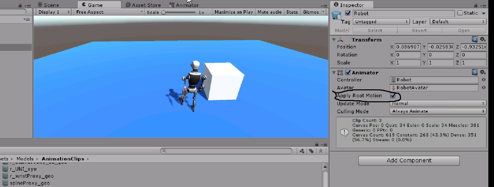
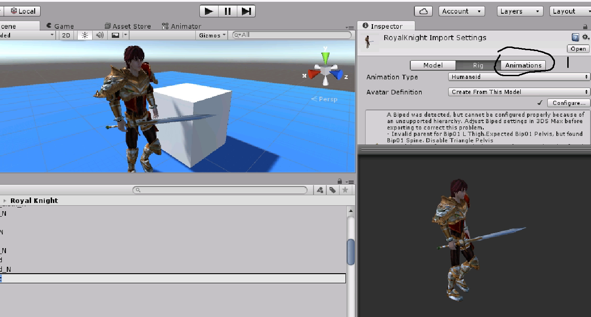
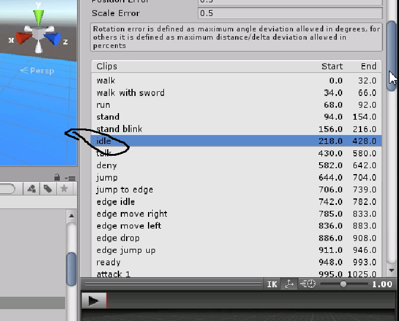
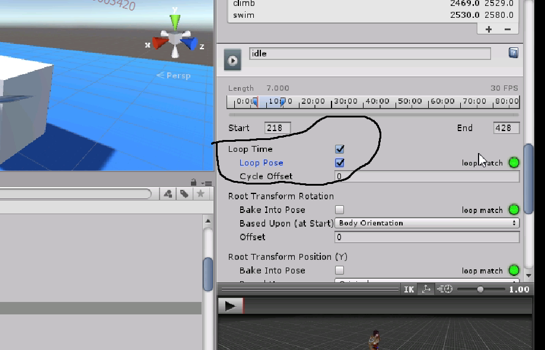
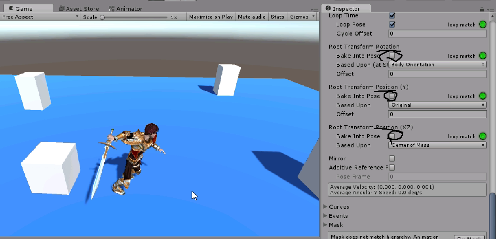
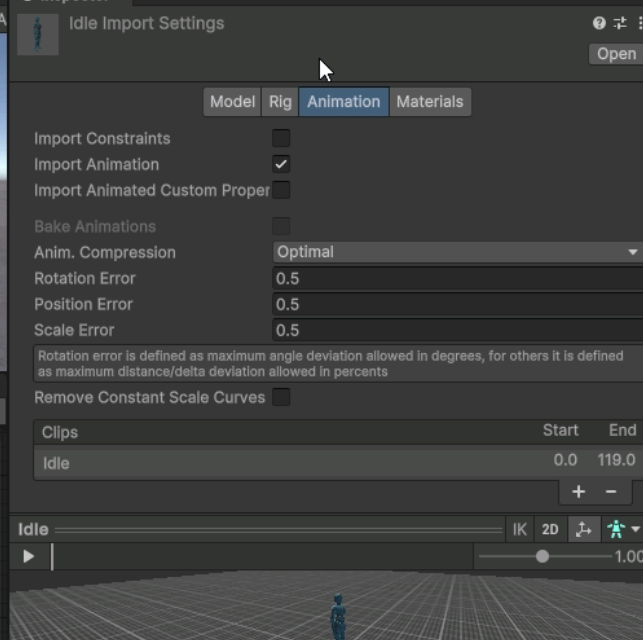
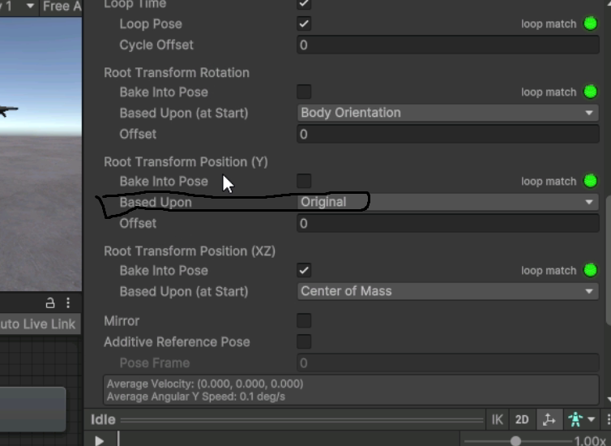
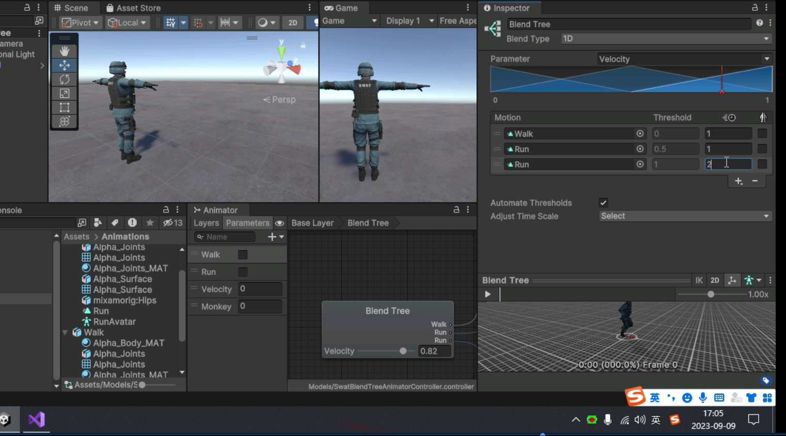
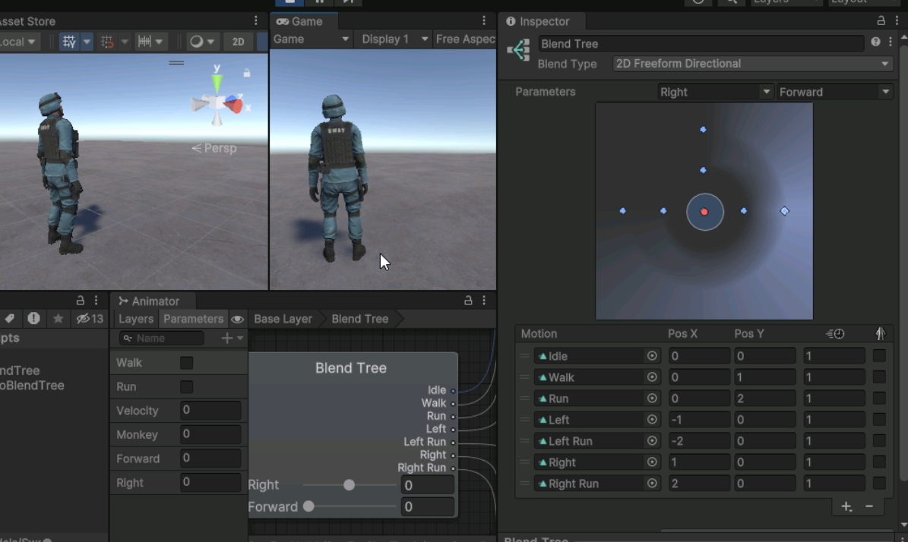

# 动画系统进阶

## 一些注意事项

### 1.使用其他动作库但是没办法做到像动作库里演示的位移



在Animator里把这个勾上。

### 2.角色应用别的动作库出现肢体扭曲

更换该动作库的Avatar

### 3.角色启动后处于悬浮状态

说明骨骼绑定正常，但是没有初始动画。

### 4.不是播放完毕之后才播放下一个动画，马上过渡的方法

将过渡线上的 Has Exit Time 复选框勾掉。

### 5.没有默认循环播放的动画如何循环播放？

1. 点击模型的动画选项卡

   

2. 选择想循环的动作

   

3. 勾选`Loop Time` 和 `Loop Pose`

   

### 6.如何关闭模型自带的位移，旋转？

在模型设置的动画选项卡里，把图示的勾上就行，分别对应旋转 ，y轴 ，xz轴。



### 7.实现人物移动和转向的代码

```csharp
using UnityEngine;
using System.Collections;

public class KnightPlayer : MonoBehaviour {

    private Transform m_Transform;
    private CharacterController m_CC;
    private Animator m_Animator;

	void Start () {
        m_Transform = gameObject.GetComponent<Transform>();
        m_CC = gameObject.GetComponent<CharacterController>();
        m_Animator = gameObject.GetComponent<Animator>();
	}
	
	void Update () {
        float h = Input.GetAxis("Horizontal");
        float v = Input.GetAxis("Vertical");
        Vector3 dir = new Vector3(h, 0, v);
        //判断当前是否走路
        if(Mathf.Abs(h) > 0.1f || Mathf.Abs(v) > 0.1f)
        {
            m_CC.SimpleMove(dir);
            //控制人物朝向
            m_Transform.LookAt(m_Transform.position + dir);
            m_Animator.SetBool("walk", true);
        }else{
            m_Animator.SetBool("walk", false);
        }


	}
}

```


### 8.摄像机跟随

```csharp
using UnityEngine;
using System.Collections;

public class CameraFollow : MonoBehaviour {

    private Transform m_Transform;
    private Transform m_PlayerTransform;

	void Start () {
        m_Transform = gameObject.GetComponent<Transform>();
        //获取人物的位置
        m_PlayerTransform = GameObject.Find("RoyalKnight").GetComponent<Transform>();
	}
	
	void Update () {
        //合适的距离加上人物的位置（距离通过挂载在人物上测试的相对坐标得出）
        Vector3 targetPos = new Vector3(0.18f, 3.06f, -2.94f) + m_PlayerTransform.position;
        //插值运算
        m_Transform.position = Vector3.Lerp(m_Transform.position, targetPos, Time.deltaTime * 5);
	}
}

```


### 9.如何动画分层

创建动画遮罩，把需要遮住的动画控制套上遮罩。

### 10.动作切换不连贯，跳帧的处理方法

依次选中三个动画文件，将 **Animation** 选项卡中的三个 **Based Upon** [基于]下拉菜单都切换成 **Original**





- **Root Transform Rotation**，基于 **Body Orientation / Original；**

  -  Body Orientation [身体定位]：保持上半身朝前；

  - Original [原件]：保持原文件中的原始旋转信息。

## 1.Mecanim 动画系统

### 1.1.创建人形 Avatar

**Avatar**：阿凡达，对模型本身的骨骼节点进行映射。

**Animation Type**：Humanoid（人形）

**Avatar Definition**：Create From This Model


## 2.IK（反向动力学的使用）

### 2.1.介绍

通过确定子骨骼的位置，然后推导出所在骨骼链上所有其他的父级骨骼位置，从而形成一个新的动作。（就是固定好某个部分和定好的物体交互，其他部分继续按原来，接近固定肢体的肢体会受到影响。）

### 2.2.使用

1. Animator 当前动作层勾选 IK Pass 选项；
2. 编写相应的 IK 控制代码。

```csharp
using UnityEngine;
using System.Collections;

public class KnightPlayer : MonoBehaviour {


    private Animator m_Animator;
    //IK绑定的物体
    public Transform IKTarget;

	void Start () {
        m_Animator = gameObject.GetComponent<Animator>();
	}
	
    void OnAnimatorIK(int index)
    {
        //权重
        m_Animator.SetIKPositionWeight(AvatarIKGoal.LeftHand, 1);
        m_Animator.SetIKRotationWeight(AvatarIKGoal.LeftHand, 1);

        //位置
        m_Animator.SetIKPosition(AvatarIKGoal.LeftHand, IKTarget.position);
        m_Animator.SetIKRotation(AvatarIKGoal.LeftHand, IKTarget.rotation);
    }

}

```

## 3.Blend Tree 混合树

混合树是什么呢？我的理解是一种两个动画之间过渡更完美，且使用尽量少的变量操作过渡过程的一种技术。

### 3.1.一维混合树

#### 1.创建混合树节点

1. 动画节点区域，点击鼠标右键：Create State --> From New Blend Tree；
2. 生成 Blend Tree 动画节点的同时，还会自动创建一个 float 类型的参数；

（参数列表中存在 float 类型的参数，则不会再自动创建 float 类型的参数。）



​                                                                                                            **混合树如图**

#### 示例：一维混合树切换走路和跑步

```csharp
using System.Collections;
using System.Collections.Generic;
using UnityEngine;

public class SwatBlendTree : MonoBehaviour
{
    private Animator m_Animator;
    private float velocity = 0.0f;
    private int velocityHash;


    void Start()
    {
        m_Animator = gameObject.GetComponent<Animator>();
        velocityHash = Animator.StringToHash("Velocity");
        Debug.Log("velocityHash:" + velocityHash);
    }


    void Update()
    {
        bool forward = Input.GetKey(KeyCode.W);

        //速度0->1.
        if (forward && velocity < 1.0f)
        {
            velocity += Time.deltaTime;
        }

        //速度1->0.
        if (!forward && velocity > 0.0f) 
        {
            velocity -= Time.deltaTime;
        }

        //重置最小值为0.
        if (!forward && velocity < 0.0f)
        {
            velocity = 0;
            Debug.Log("velocity = 0");
        }

        //重置最大值为1.
        if(velocity > 1.0f)
        {
            velocity = 1.0f;
            Debug.Log("velocity = 1.0f");
        }


        m_Animator.SetFloat(velocityHash, velocity);
    }
}

```


#### 2.二维混合树

##### 参数与节点

1. 创建两个 float 类型的参数：Forward 和 Right；
2. 创建 Blend Tree 节点，直接与 Entry 节点相连。
3. 使用 **2D Freeform Directional** 模式。



> **2D 简单定向的局限性**：
>
> 二维混合树主要使用的就是“2D 自由形式定向”模式，“2D 简单定向”模式，可以看作是“2D 自由形式定向”模式的简化版；
>
> **“2D 简单定向”模式有两个局限性：**
>
> -  单个方向只能与一个动画产生混合；
>
> -  运动方向的间隔必须小于 180 度。

##### 示例：使用 wad 加 shift 实现跑加速跑切换

```csharp
using System.Collections;
using System.Collections.Generic;
using UnityEngine;

public class SwatTwoBlendTree : MonoBehaviour
{
    private Animator m_Animator;

    //四个按键的状态.
    private bool forward;
    private bool right;
    private bool left;
    private bool run;

    //两个哈希值.
    private int forwardHash;
    private int rightHash;

    //两个参数的值.
    private float forwardValue;
    private float rightValue;

    //最大阈值, 最小阈值, 当前阈值.
    private float max = 2.0f;
    private float min = 1.0f;
    private float current;


    void Start()
    {
        m_Animator = gameObject.GetComponent<Animator>();

        //哈希值转换.
        forwardHash = Animator.StringToHash("Forward");
        rightHash = Animator.StringToHash("Right");
    }

    void Update()
    {
        //持续获取四个按键的状态.
        forward = Input.GetKey(KeyCode.W);
        right = Input.GetKey(KeyCode.D);
        left = Input.GetKey(KeyCode.A);
        run = Input.GetKey(KeyCode.LeftShift);

        CodeC();

        //Animator参数赋值.
        m_Animator.SetFloat(forwardHash, forwardValue);
        m_Animator.SetFloat(rightHash, rightValue);
    }


    /// <summary>
    /// 二段动画混合 + Shift抬起.
    /// </summary>
    private void CodeC()
    {
        //-----------Shift按键状态.-------------
        if (run)
        {
            current = max;  //2.0f;
        }
        else
        {
            current = min;  //1.0f;
        }


        //-------------数值递增.----------------
        if (forward && forwardValue < current)
        {
            forwardValue += Time.deltaTime;
        }

        if (right && rightValue < current)
        {
            rightValue += Time.deltaTime;
        }

        if (left && rightValue > -current)
        {
            rightValue -= Time.deltaTime;
        }

        //-------------数值递减.----------------
        if (!forward && forwardValue > 0.0f)
        {
            forwardValue -= Time.deltaTime;
        }

        if (!right && rightValue > 0.0f)
        {
            rightValue -= Time.deltaTime;
        }

        if (!left && rightValue < 0.0f)
        {
            rightValue += Time.deltaTime;
        }

        //----------Shift键抬起.------------
        if (current == min && forwardValue > min)
        {
            forwardValue -= Time.deltaTime;
        }

        if (current == min && rightValue > min)
        {
            rightValue -= Time.deltaTime;
        }

        if (current == min && rightValue < -min)
        {
            rightValue += Time.deltaTime;
        }
    }


}

```

