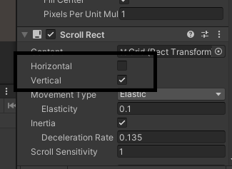

[toc]


# Git

## 1.明明连接成功了，为什么显示仓库不存在？

> **报错信息**：\342\200\234git@github.com: Permission denied (publickey). fatal: Could not read from remote repository. Please make sure you have the correct access rights and the repository exists.

看看你引号大小写对不对。`" "`还是`“ ”`。

# UI

## 1.从Resources加载图片：路径没错却加载为空？

```csharp
private Image item_Image;       //物品图标.
item_Image.sprite = Resources.Load<Sprite>("Demo/SignPanel/TexTures/item/" + itemName);
```

一定要查找Sprite，赋值给sprite属性，别弄错了。否则会出现查找为空。

还有别忘了写末尾的`/`;

## 2.滚动页面想让他只在纵向或者横向滚动怎么办？



勾下这俩。

## 3.滚动页面的元素是从中间向两边生成怎么办？

调整布局组件设置，或者把元素的锚点调整到对应位置。

## 4.如何让ui物体不受射线检测

添加CanvasGroup 组件，控制 `blocksRaycasts` 属性

或者代码控制

```csharp
m_CanvasGroup.blocksRaycasts = false 
```

## 5.如何让物体上的贴图和某些特效贴图融合（背景贴图和弹痕贴图融合）

1. 需要对导入到项目中的模型贴图，弹痕贴图进行属性设置。
   - ①勾选 Read/Write Enabled 属性；
   - ②Format 属性设置成 RGBA 32 bit。
2. 将模型身上的 BoxCollider 组件移除掉，添加 MeshCollider 组件用于碰撞检测。（因为物理射线hit只能获取MeshCollider 上的点。

**核心方法：**

```csharp
/// <summary>
    /// 弹痕融合.
    /// </summary>
    public void CreateBulletMark(RaycastHit hit)
    {
        //textureCoord:贴图UV坐标点.（获取击打位置在主贴图上的位置）
        Vector2 uv = hit.textureCoord;

        //宽度,横向,X轴.
        for (int i = 0; i < m_BulletMark.width; i++)
        {
            //高度,纵向.Y轴.
            for (int j = 0; j < m_BulletMark.height; j++)
            {
                //uv.x * 主贴图宽度- 弹痕贴图宽度/ 2 + i;
                float x = uv.x * m_MainTexture.width - m_BulletMark.width / 2 + i;

                //uv.y * 主贴图高度- 弹痕贴图高度/ 2 + j;               
                float y = uv.y * m_MainTexture.height - m_BulletMark.height / 2 + j;

                //获取到弹痕贴图上点的颜色.
                Color color = m_BulletMark.GetPixel(i, j);

                //主贴图位置融合弹痕贴图的颜色.(透明度高的像素点融合）
                if (color.a > 0.2f) m_MainTexture.SetPixel((int)x, (int)y, color);
            }
        }
        m_MainTexture.Apply();
    }
```

然后融合方只需要和它射线检测时，把射线对象传过去就可以。（m_BulletMark：素材贴图       m_MainTexture：主贴图）

# 网络相关

## 1.如何看自己电脑的ip地址

查看本机 IP 地址

①Win + R 打开运行界面，输入 cmd，进入命令行模式；

②输入 ipconfig 命令，查看本机 ip 相关信息；

③找到“无线局域网适配器 WLAN:”，将该组信息内的“IPv4 地址”复制。

[鼠标光标框选住要复制的信息，然后按快捷键 Ctrl + C 即可复制]

# 组件方面

## 1.如何控制摄像机视野，实现模拟开镜？

FOV：Field of View，是 Camera 组件上的一个控制属性；

用于控制摄像机的视野，该属性默认值是 60。

改变 FOV 值的效果：

值越大看的区域越广，看到的物体会显得越远，越小；

值越小看的区域越窄，看到的物体会显得越近，越大。

常见用途：

枪械模拟开镜效果可以通过调整 FOV 属性来实现。	


## 2.如何使用多相机，让一个相机观察主角，其他相机观察别的？

### 调整可观察的物体

首先，让角色摄像机只能观察到角色模型，通过 Camera 组件上的 Culling

Mask（剔除遮挡）属性来设置。该属性设置了摄像机能看到那些层的物体。

该属性的列表里的值是是 Layer 层的名称。

①添加一个新的层；

②把角色模型设置到该层；

③设置角色摄像机只看该层。

然后，创建一个环境摄像机，该摄像机作为角色摄像机的子物体存在。

### 调整相机观察优先级

<1>Camera 组件的 Depth 属性表示摄像机的深度，值越大，该摄像机的画面越靠前。所以说角色摄像机的 Depth 值要大于环境摄像机的 Depth。

<2>在前面渲染的角色摄像机的 Clear Flags 属性需要更改为 Depth Only。

<3>分别调整角色，环境摄像机的 FOV 值，你会发现它们只会影响自己看的的层的模型物体。

## 3.动作切换后下个动作比较慢怎么办？（射击的动作感觉比较缓慢，没有力度）

选中过渡线->右侧属性 Settings->Transition Duration(过渡时间)。

> 注意，上述属性属于控制动画是否平稳过渡，而Has Exit Time用于条件满足后控制是否立马切换。

## 4.游戏物体在场景视图显示，在游戏视图不显示，这是为什么？

查看物体是否在摄像机未遮罩的层（layer），可能你忘记设置它的layer了，它被设置在了无法被摄像机渲染的层上。